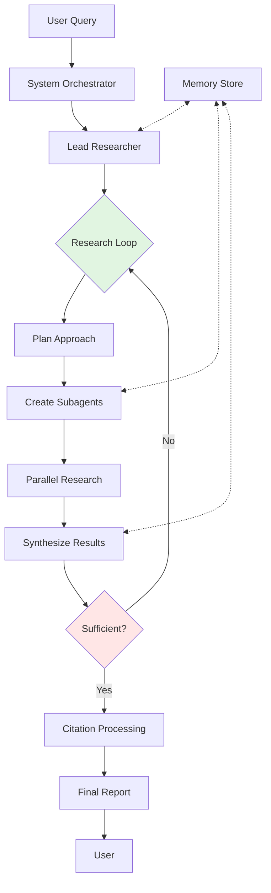

# ♂ MARS: Multi-Agent Research System

MARS is a sophisticated multi-agent system designed for comprehensive research tasks with automated citation management. It leverages specialized agents working in concert to deliver well-researched, properly cited results.

## 🏗️ Architecture Overview

MARS employs a hierarchical multi-agent architecture with the following core components:

### Core Agents

- **System Orchestrator**: Manages the overall workflow and agent coordination
- **Lead Researcher**: Plans research strategies and synthesizes results
- **Subagents**: Specialized agents that execute specific research tasks in parallel
- **Citation Agent**: Ensures proper attribution and citation formatting
- **Memory Store**: Maintains context and enables knowledge persistence across iterations

### Key Design Principles

1. **Iterative Refinement**: Research depth adapts to query complexity
2. **Parallel Execution**: Multiple subagents work simultaneously on different aspects
3. **Context Preservation**: Shared memory enables coherent multi-step research
4. **Transparent Decision-Making**: Explicit thinking and evaluation steps

## 🔄 Process Flow

## 🚀 Key Features

- **Dynamic Agent Spawning**: Creates specialized agents based on research needs
- **Web Search Integration**: Native support for online research
- **Smart Synthesis**: Combines findings from multiple sources intelligently
- **Citation Integrity**: Automatic source tracking and proper attribution
- **Persistent Memory**: Learns from previous research iterations

## 💡 Use Cases

- Academic research requiring multiple sources
- Market analysis with diverse data points
- Technical documentation with proper citations
- Competitive intelligence gathering
- Fact-checking with source verification

## 🔧 Components

| Component | Purpose |
|-----------|---------|
| System Orchestrator | Workflow management and coordination |
| Lead Researcher | Strategy planning and result synthesis |
| Subagents | Specialized task execution |
| Memory Store | Context preservation and knowledge persistence |
| Citation Agent | Source attribution and formatting |

## 📋 Example Workflow

1. User submits research query
2. System creates Lead Researcher
3. Lead Researcher develops research plan
4. Multiple subagents investigate different aspects
5. Results are synthesized and evaluated
6. Process iterates until sufficient depth achieved
7. Citations are processed and formatted
8. Final report delivered to user

## 🎯 Benefits

- **Scalable**: Handles simple to complex research tasks
- **Reliable**: Built-in quality checks and evaluation steps
- **Transparent**: Clear decision points and reasoning
- **Academic-Ready**: Proper citation management built-in

---

MARS transforms complex research tasks into manageable, well-documented outputs through intelligent agent collaboration.
